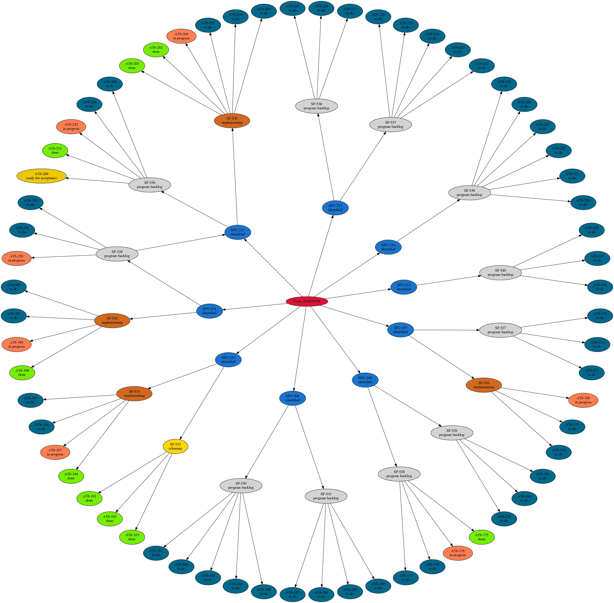

# jira-tools
Scripts to query JIRA, generate tree graphics etc.
Note these are pretty rough draft quality at present...

# Tree Diagram

First, you need to create a file called `private_jira_password.py`, which must contain a tuple `my_auth`.  
The content of this file could look something like this:  
`my_auth=('jira_username', 'jira_password')`
    
*This example will not work. Use your own SKA JIRA login details.*

Then you can run the script `make_png_tree.sh`, which will generate an image file `jira-tree-diagram.png`, and output some status information along the way.

The JIRA query is hard-coded, modify `jira-parse.py` to suit your needs. I will update to make it a bit more flexible when I get a chance.

## Example Output

```
$ ./make_png_tree.sh 
Starting with query type = Objective and labels = "Team_PERENTIE" and fixVersion="PI4"
Crawling Objective SPO-215
Crawling Objective SPO-214
Crawling Objective SPO-213
Crawling Objective SPO-212
Crawling Objective SPO-211
Crawling Objective SPO-210
Crawling Objective SPO-209
Crawling Objective SPO-208
Crawling Objective SPO-207
SPO-215 Implement custom 25G communications firmware between FPGAs to enable multi-LRU systems in preparation for optical circuit
	SP-540 Operational Optical Comms
		AT6-226 Implement 25G inter-FPGA communications firmware
		AT6-227 Add QSFP to two development boards
		AT6-228 Basic testing of communications firmware in FPGA functions as expected over the optical link
```  
*[... output continues ...]*



# Story Points by Person & Iteration

Run the `storypoints.py` script. 

Output is a table of points allocated to each person by iteration (sprint).  
Again, query is hard-coded. 

## Example Output

```
$ python3 storypoints.py 
Abel, Norbert	 12    3    2    4    0  
Bengston, Keith	  5    4    3    0   11  
Bolin, Andrew	  4   19    4    0    9  
Bunton, John	  8    6    2    3    0  
Chen, Yuqing	  4    4    0    4    4  
Hampson, Grant	 13    9    8    7    3  
Humphrey, David	  0    0    8    5    7  
Troup, Euan	  0    2   15    9    0  
```
